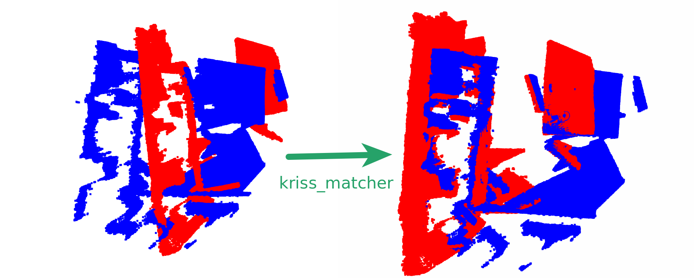

# KRISS-Matcher: Rust/Python implementation of KISS-Matcher

The implementation of the paper [KISS-Matcher: Fast and Robust Point Cloud Registration Revisited](https://web.archive.org/web/20240925020414/https://arxiv.org/abs/2409.15615).



<!-- markdown-toc start - Don't edit this section. Run M-x markdown-toc-refresh-toc -->
**Table of Contents**

- [KRISS-Matcher: Rust/Python implementation of KISS-Matcher](#kriss-matcher-rustpython-implementation-of-kiss-matcher)
    - [Disclaimer](#disclaimer)
    - [Differences from the Original Paper](#differences-from-the-original-paper)
    - [Code Structure and Correspondence to Paper Sections](#code-structure-and-correspondence-to-paper-sections)
        - [Section III.C. Faster-PFH: Boosting FPFH Speed](#section-iiic-faster-pfh-boosting-fpfh-speed)
        - [Section III.D. k-Core-Based Graph-Theoretic Outlier Pruning](#section-iiid-k-core-based-graph-theoretic-outlier-pruning)
        - [Section III.E. Graduated Non-Convexity-Based Non-Minimal Solver](#section-iiie-graduated-non-convexity-based-non-minimal-solver)
    - [Usage](#usage)
    - [Contributing](#contributing)
    - [License](#license)

<!-- markdown-toc end -->


## Disclaimer

This project is my first complete implementation in Rust, created out of curiosity and a desire to learn the language while implementing the concepts from the paper. It was developed over a weekend, so it may not be production-ready. Feedback and contributions are welcome!

## Differences from the Original Paper

This implementation has some differences:

1. **Single Radius Search**:
   - This implementation uses only `r_normal` instead of sub-sampling from `r_fpfh`. There are no particular reasons, just to ease implementation since it seemed non-important.

2. **Histogram Bin Size**:
   - The paper does not specify the histogram bin size (`H`) used in the calculation of FPFH (Fast Point Feature Histogram). More information on my choice is [here]().

3. **GNC Solver for Rotation and Translation Estimation**:
   - The paper does not provide details on the specific GNC (Graduated Non-Convexity) solver used.
   - My implementation adapts the GNC-TLS (Truncated Least Squares) solver from the [TEASER++ library](https://web.archive.org/web/20241009152000/https://github.com/MIT-SPARK/TEASER-plusplus/blob/9ca20d9b52fcb631e7f8c9e3cc55c5ba131cc4e6/teaser/src/registration.cc#L730-L832).
   - Residual calculation function adapts methods from [Least-Squares Rigid Motion Using SVD](https://web.archive.org/web/20240313224740/https://igl.ethz.ch/projects/ARAP/svd_rot.pdf).

4. **Normal Estimation Using SVD Instead of PCA**:
   - The implementation uses Singular Value Decomposition (SVD) instead of Principal Component Analysis (PCA) for normal estimation.
   - Since the matrices are small, performance is not a significant concern, and SVD provides more stable results.

5. **Graph Representation in Correspondence Pruning**:
   - While the paper suggests using Compressed Sparse Row (CSR) representation for efficiency, this implementation uses a standard adjacency list graph (CSR can be easily integrated, tho).

## Code Structure and Correspondence to Paper Sections

### Section III.C. Faster-PFH: Boosting FPFH Speed

Also covers "Appendix.I. Detailed Explanation of Faster-PFH".

* Normal Estimation and filtering: `normal_estimation.rs`
* Point Feature Histogram Calculation: `point_feature_histograms.rs`
* Feature Matching: `feature_matching.rs`

### Section III.D. k-Core-Based Graph-Theoretic Outlier Pruning

* Correspondence Graph Pruning: `graph_pruning.rs`

### Section III.E. Graduated Non-Convexity-Based Non-Minimal Solver

* Optimal Rotation and Translation Estimation: `gnc_solver.rs`

## Usage

To add library to your rust project use:

``` shell
$ cargo add kriss_matcher
```

To use in Python use any package managers such as pip or [uv](https://web.archive.org/web/20241009202137/https://docs.astral.sh/uv/).

``` shell
$ pip install kriss_matcher
```
or

``` shell
$ uv add kriss_matcher
```

To run the example you can use:

``` shell
uv run --no-project --python=3.11 examples/example.py
```
it will install all required dependencies.

You can also refer to `kruss_matcher.pyi` to see the documentation:

``` python
def find_point_cloud_transformation(
    source_points: np.ndarray, target_points: np.ndarray, voxel_size: float
) -> Tuple[np.ndarray, np.ndarray]:
    """
    Finds the transformation (rotation and translation) between two point clouds.

    Args:
        source_points: A 2D numpy array of shape (n, 3), where n is the number of points.
        target_points: A 2D numpy array of shape (n, 3), where n is the number of points.
        voxel_size: A float representing the size of the voxel grid used in the transformation.

    Returns:
        A tuple of two numpy 2D arrays:
            - The first array is the rotation matrix.
            - The second array is the translation matrix.
    """
```

## Contributing

Feel free to open issues or submit pull requests if you find bugs or have suggestions for improvements.

## License

This project is open-sourced under the Apache Version 2.0 License.
